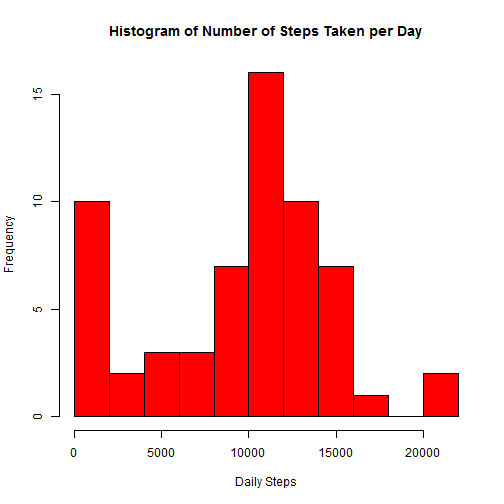
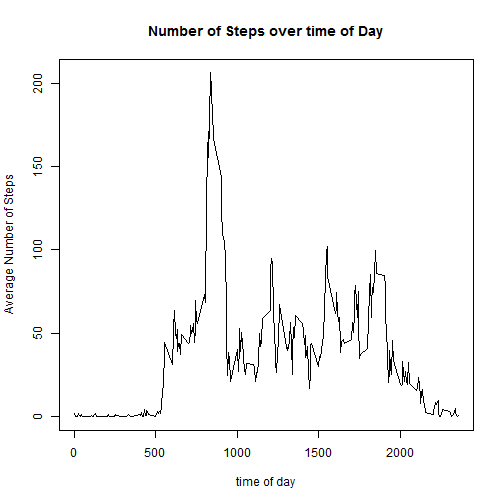
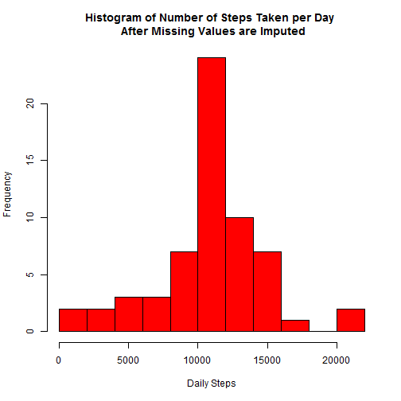
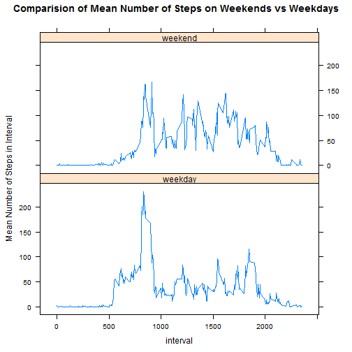

## Loading and preprocessing the data

```r
options(scipen = 5,digits = 0)
unzip("activity.zip")
activity_data <- read.csv("activity.csv")
```


## What is mean total number of steps taken per day?


```r
library(dplyr)
daily_steps <- group_by(activity_data,date) %.% 
    summarise(total = sum(steps,na.rm = TRUE))
hist(daily_steps$total, xlab = "Daily Steps", ylab = "Frequency", col="red", 
     main = "Histogram of Number of Steps Taken per Day",breaks=10)
```

 

```r
mean_steps <-  mean(daily_steps$total, na.rm = TRUE)
mean_steps
```

```
## [1] 9354
```

```r
median_steps <- median(daily_steps$total, na.rm = TRUE)
median_steps
```

```
## [1] 10395
```


The mean number of steps taken per day is: 
**9354**  
The median number of steps taken per day is: 
**10395**

Note that the above values and histogram still represents days with no valid number of steps as having zero steps which skews the histogram as well as the mean and median values.  


## What is the average daily activity pattern?


```r
interval_steps <- group_by(activity_data,interval) %.% summarise(mean_steps=mean(steps,na.rm=TRUE))
plot(x=interval_steps$interval,y=interval_steps$mean_steps,type = "l",
     xlab="time of day", ylab = "Average Number of Steps", 
     main = "Number of Steps over time of Day")
```

 

```r
max_steps_interval <- max(interval_steps$mean_steps)
max_steps_interval
```

```
## [1] 206
```

```r
interval_with_max_steps <- interval_steps[interval_steps$mean_steps == 
                                              max(interval_steps$mean_steps),1]
interval_with_max_steps
```

```
## [1] 835
```

The interval with the highest average number of steps is **835** 
with an average of **206** steps

## Imputing missing values

```r
# Get index of missing values
index_na <-  which(is.na(activity_data$steps))
num_na <- length(index_na)

# Number of missing values
num_na
```

```
## [1] 2304
```

The number of missing values in the dataset is **2304**


```r
# create clone of existing data set and replace any data with N/A values by mean for that 
# period

cleaned_data <- activity_data

for(x in index_na)
    {
    cleaned_data[x,1] <- interval_steps[interval_steps$interval == cleaned_data[x,3],2]  
    }

cleaned_daily_steps <- group_by(cleaned_data,date) %.% 
    summarise(total = sum(steps,na.rm = TRUE))

hist(cleaned_daily_steps$total, xlab = "Daily Steps", ylab = "Frequency", col="red", 
     main = "Histogram of Number of Steps Taken per Day \n After Missing Values are Imputed",
     breaks=10)
```

 


```r
mean_steps <-  mean(cleaned_daily_steps$total, na.rm = TRUE)
mean_steps
```

```
## [1] 10766
```

```r
median_steps <- median(cleaned_daily_steps$total, na.rm = TRUE)
median_steps
```

```
## [1] 10766
```


The mean number of steps taken per day is: 
**10766**  
The median number of steps taken per day is: 
**10766**

*Do these values differ from the estimates from the first part of the assignment?* 
*What is the impact of imputing missing data on the estimates of the total daily number of steps?*

The imputing of missing data has has increased the step count of many of the days. This has 
been reflect the histogram by the reduction in the frequency of days in the lowest part of the 
histogram. The data now looks more like a normal distribution.Furthermore both the mean and
the median of the dataset has been increased.This is to be expected as in the previous section periods with N/A were counted as having a value of 0 which skewed the findings.  

## Are there differences in activity patterns between weekdays and weekends?


```r
library(lattice)
weekend <- c("Saturday", "Sunday")
ww_data <- cleaned_data %.% 
    mutate(day_type = ifelse(weekdays(as.Date(date)) %in% weekend, "weekend", "weekday")) %.%
    group_by(interval,day_type) %.%
    summarise(interval_mean = mean(steps))

xyplot(interval_mean~interval|day_type,ww_data,type = "l", 
       layout = c(1, 2),
       ylab = "Mean Number of Steps in Interval", 
       main = "Comparision of Mean Number of Steps on Weekends vs Weekdays")
```

 

The data for the weekend shows a relatively consistent number of steps between the hours of 08:00 to 19:00. The data for week days has the number of steps between the hours of 08:00 to 09:00 twice as that of the number of steps between 09:00 to 19:00. The average number of steps after 09:00 on weekdays appears to be less than the corresponding period on weekends.    
